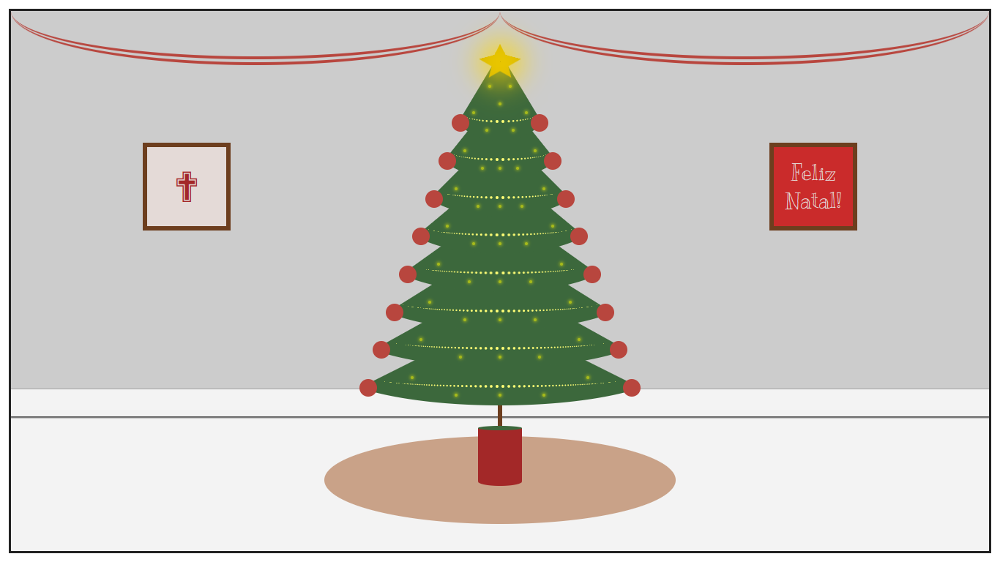
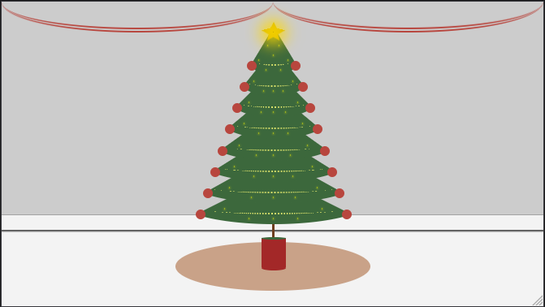

# :christmas_tree: Christmas tree

 Este projeto apresenta uma árvore de Natal criada com HTML e CSS puro.

 A árvore possui enfeites e alguns deles simulam efeitos de iluminação. Ela é exibida numa sala com decoração natalina.

 Este projeto utiliza recursos como variáveis CSS, propriedades *position* e *transform*, pseudo-elementos além de *animations*.

## :gear: Tecnologias

- HTML
- CSS

## :art: Layout

